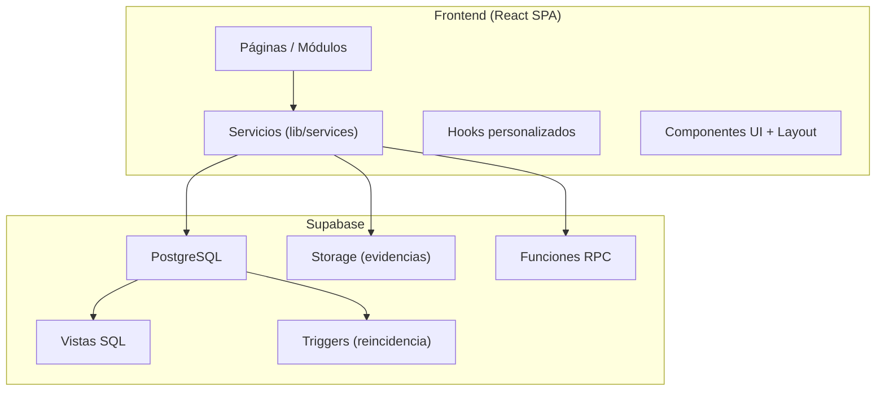

# Documentación del Sistema — Control de Incidencias Escolares

Documento de referencia técnica y funcional del proyecto. Describe qué es el sistema, cómo está construido, qué módulos incluye y cómo se relacionan entre sí.

---

## Tabla de contenidos

1. [Visión general](#1-visión-general)
2. [Stack tecnológico](#2-stack-tecnológico)
3. [Arquitectura](#3-arquitectura)
4. [Roles y permisos](#4-roles-y-permisos)
5. [Módulos y pantallas](#5-módulos-y-pantallas)
6. [Capa de servicios](#6-capa-de-servicios)
7. [Base de datos (Supabase)](#7-base-de-datos-supabase)
8. [Sistema de reincidencia](#8-sistema-de-reincidencia)
9. [Seguridad](#9-seguridad)
10. [Estructura del proyecto](#10-estructura-del-proyecto)
11. [Scripts SQL incluidos](#11-scripts-sql-incluidos)
12. [Documentación existente](#12-documentación-existente)
13. [Instalación y despliegue](#13-instalación-y-despliegue)

---

## 1. Visión general

**Sistema de Control de Incidencias Escolares** es una aplicación web para instituciones educativas (primaria y secundaria) que centraliza:

| Área | Qué gestiona |
|------|----------------|
| **Incidencias** | Faltas disciplinarias, evidencias fotográficas, comentarios, justificación y anulación |
| **Asistencia** | Llegadas, tardanzas, salidas y alertas de salida no registrada |
| **Estudiantes** | Fichas, código de barras, contacto familiar y nivel de reincidencia |
| **Padres** | Portal de consulta, citas y seguimiento de asistencia |
| **Reportes** | Incidencias y asistencias por bimestre, exportación PDF/Excel |
| **Administración** | Configuración, auditoría y catálogo de faltas |

No requiere un backend propio aparte de **Supabase** (PostgreSQL + Storage + RPC). El frontend es una SPA en React que consume la API de Supabase directamente.

---

## 2. Stack tecnológico

| Capa | Tecnología |
|------|------------|
| **Build** | Vite 5 |
| **UI** | React 18, TypeScript |
| **Estilos** | Tailwind CSS, shadcn/ui (Radix UI) |
| **Routing** | React Router v6 |
| **Estado remoto** | TanStack React Query (caché 5 min) |
| **Formularios** | React Hook Form + Zod |
| **Gráficos** | Recharts |
| **Animaciones** | @react-spring/web |
| **Backend** | Supabase (`@supabase/supabase-js`) |
| **Exportación** | jsPDF, html2canvas, ExcelJS |
| **Fechas** | date-fns |

---

## 3. Arquitectura



### Flujo de autenticación

1. El usuario inicia sesión en `/login`.
2. `authService` valida credenciales vía RPC `validar_password` y guarda la sesión en `sessionService` (localStorage).
3. `ProtectedRoute` comprueba usuario y rol antes de renderizar cada ruta.
4. `useSessionMonitor` vigila inactividad (30 min) y redirige al login si expira.
5. La ruta `/` redirige según rol: Tutor → escáner, Padre → portal, resto → dashboard.

### Code splitting

Todas las páginas se cargan con `React.lazy()` y `Suspense` para reducir el bundle inicial. Vite separa vendors en chunks (`react-vendor`, `ui-vendor`, `chart-vendor`, etc.).

---

## 4. Roles y permisos

| Rol | Descripción | Rutas principales |
|-----|-------------|-------------------|
| **Admin** | Acceso total | Dashboard, incidencias, estudiantes, reportes, auditoría, configuración, catálogo de faltas |
| **Director** | Gestión académica y reportes | Igual que Admin excepto auditoría y configuración del sistema |
| **Supervisor** | Operación diaria | Registro de incidencias, asistencia, estudiantes, citas, justificación, reportes básicos |
| **Tutor** | Escaneo rápido | Solo `/tutor-scanner` (código de barras, incidencias y llegadas) |
| **Padre** | Consulta | Solo `/parent-portal` |

La matriz de rutas está definida en `src/App.tsx` con `ProtectedRoute` y `requiredRole`.

---

## 5. Módulos y pantallas

### 5.1 Login (`/login`)

- Autenticación por usuario y contraseña.
- Rate limiting (5 intentos / 15 min).
- Sanitización de inputs.
- Redirección automática si ya hay sesión activa.

### 5.2 Dashboard (`/dashboard`)

**Roles:** Supervisor, Director, Admin.

- Métricas del mes: total incidencias, % con evidencia, falta más común, grado con más incidencias.
- Distribución por nivel de reincidencia (0–5).
- Incidencias recientes.
- **Alertas de salida:** estudiantes con llegada registrada pero sin salida (actualización cada 5 min).
- Acciones rápidas hacia otros módulos.
- Datos desde `dashboardService` y vista `v_dashboard_ejecutivo`.

### 5.3 Control de asistencia (`/arrival-control`)

**Roles:** Supervisor, Director, Admin.

- Registro de llegada (a tiempo / tarde) por estudiante.
- Registro de salida (Normal, Autorizada, Sin registro).
- Selector de fecha para historial.
- Estadísticas del día seleccionado.
- Servicio: `arrivalService`.

### 5.4 Incidencias

| Ruta | Pantalla | Función |
|------|----------|---------|
| `/register` | Registrar incidencia | Búsqueda por código de barras, selección de falta, observaciones, subida de evidencias |
| `/incidents` | Lista de incidencias | Filtros, detalle, anulación, comentarios, impresión |
| `/justify-faults` | Justificar faltas | Cambio de estado a **Justificada** con motivo |

Servicios: `incidentsService`, `evidenceService`, `commentsService`.

Estados de incidencia: `Activa`, `Anulada`, `En revisión`, `Justificada`.

### 5.5 Estudiantes (`/students`)

**Roles:** Supervisor, Director, Admin.

- CRUD de estudiantes (nombre, grado, sección, nivel, código de barras, foto).
- Datos de contacto familiar: teléfono, email, responsable, parentesco, emergencia.
- Visualización del **nivel de reincidencia** (`ReincidenceBadge`).
- Servicio: `studentsService` (consulta vista `v_estudiantes_nivel_actual`).

### 5.6 Catálogo de faltas (`/faults`)

**Roles:** Director, Admin.

- Tipos de falta por categoría: Conducta, Uniforme, Académica, Puntualidad.
- Severidad: Leve / Grave.
- Puntos de reincidencia por falta.
- Servicio: `faultsService`.

### 5.7 Citas con padres (`/parent-meetings`)

**Roles:** Supervisor, Director, Admin.

- Crear, confirmar, reprogramar, cancelar citas.
- Registrar asistencia del padre y llegada tarde a la cita.
- Estadísticas de asistencia a citas.
- Tabla BD: `citas_padres`.
- Servicio: `parentMeetingsService`.

### 5.8 Portal para padres (`/parent-portal`)

**Roles:** Padre (también acceso staff para pruebas).

- Información del estudiante vinculado.
- Estadísticas mensuales de asistencia.
- Historial de entradas y salidas.
- Alertas si no hay salida registrada.
- Citas programadas.

### 5.9 Reportes

| Ruta | Contenido |
|------|-----------|
| `/reports` | Reportes de incidencias por nivel, grado, bimestre; export PDF/Excel |
| `/attendance-report` | Matriz mensual/bimestral de asistencia; export PDF/Excel |

Filtros: año escolar, bimestre (calendario peruano marzo–diciembre), nivel, grado, sección. Utilidad: `bimestreUtils.ts`.

### 5.10 Escáner de tutor (`/tutor-scanner`)

**Rol:** Tutor.

- Interfaz simplificada sin sidebar completo.
- Escaneo o ingreso manual de código de barras.
- Consulta de perfil del estudiante.
- Registro rápido de incidencia y de llegada.
- Restringido a grados asignados al tutor (`grados_asignados`).

### 5.11 Administración

| Ruta | Pantalla | Rol |
|------|----------|-----|
| `/audit` | Logs de auditoría (INSERT/UPDATE/DELETE) | Admin |
| `/system-config` | Parámetros del sistema y algoritmo de reincidencia | Admin |

Servicios: `auditService`, `configService`.

---

## 6. Capa de servicios

Ubicación: `src/lib/services/`

| Servicio | Responsabilidad |
|----------|-----------------|
| `authService` | Login, logout, usuario actual, bloqueo por intentos fallidos |
| `sessionService` | Persistencia y expiración de sesión (30 min) |
| `studentsService` | CRUD estudiantes, búsqueda por código de barras, nivel reincidencia |
| `faultsService` | Catálogo de faltas |
| `incidentsService` | Incidencias, filtros, anulación, justificación |
| `evidenceService` | Subida/borrado de fotos en bucket `evidencias` |
| `commentsService` | Comentarios en incidencias |
| `dashboardService` | Estadísticas ejecutivas y alertas de salida |
| `arrivalService` | Llegadas, salidas, reportes de asistencia |
| `parentMeetingsService` | Citas con padres |
| `auditService` | Consulta de logs de auditoría |
| `configService` | Configuración global y reincidencia |

Cliente Supabase: `src/lib/supabaseClient.ts`.

---

## 7. Base de datos (Supabase)

### Tablas principales

| Tabla | Uso |
|-------|-----|
| `usuarios` | Cuentas del sistema (roles, bloqueo, intentos fallidos) |
| `estudiantes` | Alumnos, código de barras, contacto familiar |
| `catalogo_faltas` | Tipos de falta y puntos |
| `incidencias` | Registro de faltas, nivel reincidencia, estado, evidencia |
| `evidencias_fotograficas` | Metadatos de fotos en Storage |
| `comentarios_incidencias` | Comentarios por incidencia |
| `registros_llegada` | Asistencia: llegada, salida, tipo de salida |
| `citas_padres` | Reuniones con padres |
| `configuracion_sistema` | Clave-valor de configuración |
| `configuracion_reincidencia` | Ventana, puntos y umbrales por nivel |
| `auditoria_logs` | Trazabilidad de cambios |

### Vistas

- `v_dashboard_ejecutivo` — métricas agregadas para el dashboard.
- `v_estudiantes_nivel_actual` — nivel de reincidencia y faltas en ventana (ej. 60 días).

### Storage

- Bucket **`evidencias`**: fotografías adjuntas a incidencias.

### Funciones RPC

- `validar_password` — validación de credenciales (texto plano en desarrollo; bcrypt en producción).
- Otras funciones según scripts en `FUNCIONES_SQL_REQUERIDAS.sql`.

---

## 8. Sistema de reincidencia

Mecanismo automático que clasifica el comportamiento del estudiante en **niveles 0 a 5**.

1. Al insertar una incidencia, un **trigger** ejecuta `calcular_nivel_reincidencia()`.
2. Se suman puntos de faltas **activas** en una ventana configurable (ej. 60 días).
3. Faltas leves y graves aportan puntos distintos (`configuracion_reincidencia`).
4. El total se compara con umbrales para asignar el nivel.
5. El frontend muestra el nivel con `ReincidenceBadge` (colores por severidad).

Documentación detallada: `EXPLICACION_SISTEMA_REINCIDENCIA.md`.

---

## 9. Seguridad

| Medida | Implementación |
|--------|----------------|
| Rutas protegidas | `ProtectedRoute` + roles por ruta |
| Expiración de sesión | 30 min inactividad (`sessionService`, `useSessionMonitor`) |
| Rate limiting login | 5 intentos / 15 min (`rateLimit.ts`) |
| Sanitización XSS | `sanitize.ts` en login y formularios |
| Bloqueo de cuenta | Tras 5 intentos fallidos en BD |
| Headers HTTP | CSP, X-Frame-Options, etc. en `index.html` |
| Row Level Security | Pendiente/configurable en Supabase (`CONFIGURACION_RLS_PADRES.md`) |

Documentación: `MEJORAS_SEGURIDAD.md`.

> **Producción:** usar bcrypt para contraseñas (`FUNCION_VALIDAR_PASSWORD_BCRYPT.sql`), configurar RLS y no dejar contraseñas en texto plano.

---

## 10. Estructura del proyecto

```
mock-flow-designer-06014/
├── public/                    # Assets estáticos
├── src/
│   ├── App.tsx                # Rutas y providers
│   ├── main.tsx               # Punto de entrada
│   ├── pages/                 # Pantallas por módulo
│   ├── components/
│   │   ├── auth/              # ProtectedRoute
│   │   ├── layout/            # Layout, Sidebar, Navbar
│   │   ├── shared/            # Badges, imágenes optimizadas
│   │   └── ui/                # shadcn/ui
│   ├── hooks/                 # Sesión, filtros, toast, accesibilidad
│   ├── lib/
│   │   ├── services/          # Capa de datos Supabase
│   │   ├── utils/             # Bimestres, reincidencia, sanitize, rate limit
│   │   ├── constants/         # Colores, tema
│   │   └── supabaseClient.ts
│   └── types/index.ts         # Tipos TS alineados al esquema BD
├── *.sql                      # Migraciones y correcciones
├── *.md                       # Documentación operativa
├── package.json
├── vite.config.ts
└── tailwind.config.ts
```

### Hooks destacados

| Hook | Uso |
|------|-----|
| `useSessionMonitor` | Vigila expiración de sesión |
| `useFilters` | Filtros reutilizables en listados |
| `useErrorDialog` | Diálogos de error consistentes |
| `useKeyboardNavigation` | Accesibilidad por teclado |
| `usePerformanceMetrics` | Métricas de rendimiento (dev) |
| `useLoadingScreen` | Pantallas de carga |

### Componentes compartidos

- `ReincidenceBadge` — badge de nivel 0–5.
- `SeverityBadge` — leve / grave.
- `ErrorBoundary` — captura errores de React.
- `PageLoader` / `LoadingScreen` — estados de carga.

---

## 11. Scripts SQL incluidos

| Archivo | Propósito |
|---------|-----------|
| `FUNCIONES_SQL_REQUERIDAS.sql` | Función `validar_password` y RPC base |
| `FUNCION_VALIDAR_PASSWORD_BCRYPT.sql` | Validación con bcrypt (producción) |
| `CREAR_TABLA_CITAS_PADRES.sql` | Tabla de citas con padres |
| `ACTUALIZAR_ESTUDIANTES_CONTACTO.sql` | Campos de contacto familiar |
| `ACTUALIZAR_REGISTROS_LLEGADA_SALIDAS.sql` | Control de salidas |
| `ACTUALIZAR_CITAS_PADRES_LLEGADA_TARDE.sql` | Llegada tarde a citas |
| `AGREGAR_ESTADO_JUSTIFICADA*.sql` | Estado Justificada en incidencias |
| `SOLUCION_REINCIDENCIA.sql` / `SOLUCION_COMPLETA_REINCIDENCIA.sql` | Correcciones algoritmo reincidencia |
| `CORREGIR_REINCIDENCIA_USANDO_PUNTOS_INDIVIDUALES.sql` | Puntos por falta del catálogo |
| `CORREGIR_AUDITORIA_LOGS.sql` | Ajustes tabla auditoría |
| `CREAR_BUCKETS_STORAGE.sql` | Bucket evidencias |
| `VERIFICAR_ESTADO_JUSTIFICADA.sql` | Verificación migración |

Ejecutar en **Supabase → SQL Editor** en el orden indicado en `CONFIGURACION_COMPLETA.md`.

---

## 12. Documentación existente

| Archivo | Contenido |
|---------|-----------|
| `MANUAL_DE_USUARIO.md` | Guía paso a paso para usuarios finales |
| `CONFIGURACION_COMPLETA.md` | Checklist de puesta en marcha |
| `CONFIGURACION_BD.md` | Conexión Supabase, Storage, RPC |
| `CONFIGURACION_RLS_PADRES.md` | Políticas RLS para rol Padre |
| `RESUMEN_IMPLEMENTACION.md` | Funcionalidades implementadas por fase |
| `EXPLICACION_SISTEMA_REINCIDENCIA.md` | Algoritmo de reincidencia |
| `MEJORAS_SEGURIDAD.md` | Sesión, rate limit, sanitización |
| `MEJORAS_IMPLEMENTADAS.md` | Lazy loading, accesibilidad, build |
| `LOADING_SCREEN_USAGE.md` | Uso de pantallas de carga |
| `ERROR_DIALOG_USAGE.md` | Diálogos de error |
| `INSTRUCCIONES_FUNCION_SQL.md` | Instalación de funciones SQL |
| `DIAGNOSTICO_REINCIDENCIA.md` | Troubleshooting reincidencia |

Este archivo (`DOCUMENTACION_SISTEMA.md`) es la **visión técnica consolidada**; el manual de usuario cubre el uso operativo día a día.

---

## 13. Instalación y despliegue

### Requisitos

- Node.js y npm
- Proyecto Supabase configurado (URL y anon key en `supabaseClient.ts` o variables de entorno)

### Desarrollo local

```bash
npm install
npm run dev
```

### Build de producción

```bash
npm run build
npm run preview   # previsualizar build
```

### Despliegue

- Publicación vía [Lovable](https://lovable.dev) (Share → Publish), o
- Hosting estático del contenido de `dist/` (Vercel, Netlify, etc.)

### Checklist mínimo antes de usar

1. Ejecutar script SQL de tablas en Supabase.
2. Ejecutar `FUNCIONES_SQL_REQUERIDAS.sql`.
3. Crear bucket `evidencias` y políticas de Storage.
4. Crear usuarios de prueba (ver `CONFIGURACION_COMPLETA.md`).
5. Aplicar migraciones de contacto, salidas y citas si aún no están en el esquema.
6. Configurar RLS según el entorno (desarrollo vs producción).

### Usuarios de prueba (desarrollo)

| Usuario | Contraseña | Rol |
|---------|------------|-----|
| admin | admin123 | Admin |
| supervisor | supervisor123 | Supervisor |
| tutor | tutor123 | Tutor |

---

## Resumen ejecutivo

El sistema es una **SPA React + Supabase** para gestión escolar integral: incidencias con reincidencia automática, asistencia con control de salidas, citas con padres, portal familiar y reportes por bimestre. Cinco roles definen qué puede ver y hacer cada usuario. La lógica crítica (contraseñas, reincidencia, auditoría) vive en PostgreSQL mediante funciones, triggers y vistas; el frontend orquesta la experiencia y consume servicios tipados en TypeScript.

Para uso diario del personal, consultar **`MANUAL_DE_USUARIO.md`**. Para configurar el entorno, **`CONFIGURACION_COMPLETA.md`**.

---

*Última actualización: documento generado a partir del estado del repositorio.*
